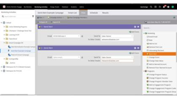
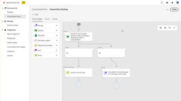
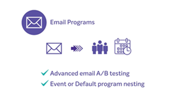

# [!DNL Marketo Engage] 教學課程

瀏覽我們的教學課程庫，充分利用[!DNL Marketo Engage]。 這些教學課程有助於補充[[!DNL Marketo] 產品檔案](https://experienceleague.adobe.com/docs/marketo/using/home.html?lang=zh-Hant){target="_blank"}，協助您進一步瞭解行銷自動化功能。

<!-- 

 -->

## 新增功能 {#whats-new}

* [互動式網路研討會總覽](https://experienceleague.adobe.com/en/docs/marketo-learn/tutorials/events/interactive-webinars-overview)
  _深入瞭解Marketo Engage內建的互動式網路研討會平台。_

* [移轉至Adobe Identity Management](https://experienceleague.adobe.com/en/docs/marketo-learn/tutorials/fundamentals/migrating-to-adobe-identity-management)
  _瞭解如何導覽Adobe Identity Management移轉，以便開始集中管理使用者的Adobe Marketo Engage及其他Adobe帳戶和產品。_

* [互動式網路研討會活動後的深入分析與行動](https://experienceleague.adobe.com/zh-hant/docs/marketo-learn/tutorials/events/interactive-webinars-post-event-insights-and-actions)
  _瞭解在何處尋找有關互動式網路研討會活動效能和參與情況的詳細資訊。_

## 最受歡迎影片 {#most-popular-videos}

<table>
<tr>
<td>

<a href="https://experienceleague.adobe.com/zh-hant/docs/marketo-learn/tutorials/programs-and-campaigns/smart-campaigns-101"><strong>Smart Campaigns 101</strong></a>

</td>
<td>

<a href="https://experienceleague.adobe.com/en/docs/marketo-learn/tutorials/dynamic-chat/conversational-forms"><strong>對話式Forms</strong></a>

</td>
<td>

<a href="https://experienceleague.adobe.com/zh-hant/docs/marketo-learn/tutorials/fundamentals/programs-and-campaigns"><strong>了解 Marketo 計劃和行銷活動</strong></a>

</td>
</tr>
</table>
