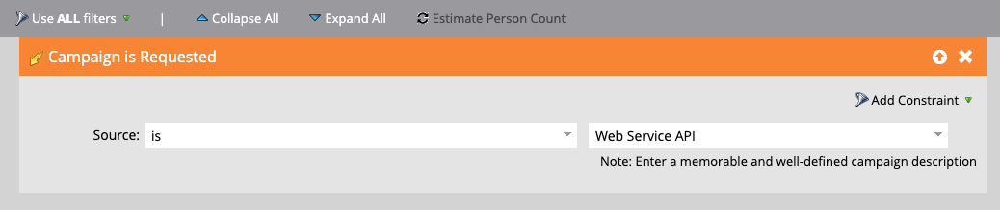
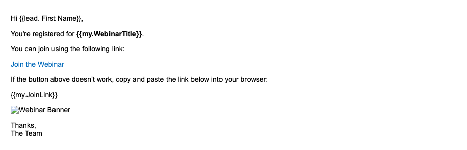
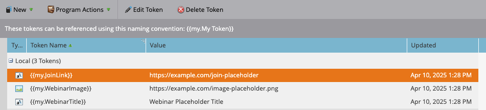
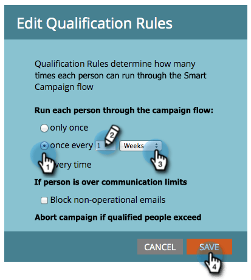

# 如何使用REST API和權杖在Marketo Engage中觸發Smart Campaign

本教學課程將逐步引導您瞭解如何使用REST API在Marketo Engage中觸發Smart Campaign，並使用「我的Token」個人化電子郵件。 此使用案例適用於客戶觸發的通知，例如網路研討會提醒、入門步驟或購買後跟進。

## 使用案例 {#use-case}

人員透過外部平台註冊網路研討會（例如自訂應用程式、Pendo、Eventbrite）。 您想要自動：

* 觸發來自Marketo Engage的提醒電子郵件
* 透過以下方式個人化：
   * 人員的名字
   * 網路研討會標題
   * 不重複加入連結

您可以使用REST API和「我的Token」完成此操作。

## 步驟1：建立Smart Campaign {#step-one}

1. 移至&#x200B;**行銷活動**，並在您的[方案](https://experienceleague.adobe.com/zh-hant/docs/marketo/using/product-docs/core-marketo-concepts/programs/creating-programs/understanding-programs){target="_blank"}資料夾下，建立名為`Send Webinar Reminder`的新[智慧行銷活動](https://experienceleague.adobe.com/zh-hant/docs/marketo/using/product-docs/core-marketo-concepts/smart-campaigns/understanding-smart-campaigns){target="_blank"}。

1. 在&#x200B;**智慧清單**&#x200B;索引標籤中，[新增觸發器](https://experienceleague.adobe.com/zh-hant/docs/marketo/using/product-docs/core-marketo-concepts/smart-campaigns/creating-a-smart-campaign/define-smart-list-for-smart-campaign-trigger){target="_blank"}以允許透過API呼叫行銷活動：

   * 選取&#x200B;**已要求行銷活動**&#x200B;作為觸發器
   * 將&#x200B;**Source**&#x200B;設為`Web Service API`



## 步驟2：定義電子郵件內容 {#step-two}

建立或編輯同時參考個人和[我的Token](https://experienceleague.adobe.com/zh-hant/docs/marketo/using/product-docs/core-marketo-concepts/programs/tokens/managing-my-tokens){target="_blank"}的[電子郵件資產](https://experienceleague.adobe.com/zh-hant/docs/marketo-developer/marketo/rest/assets/emails){target="_blank"}。

>[!NOTE]
>
>請務必直接將代號插入電子郵件內容，如下所示。

```html
Hi {{lead.First Name:default=Customer}}

You're registered for **{{my.WebinarTitle}}**.

Join here: {{my.JoinLink}}
```

如果您使用權杖來動態插入影像URL （例如`{{my.WebinarImage}}`），您必須將權杖包裝在HTML影像標籤中：

```html

```

>[!IMPORTANT]
>
>除非將權杖放在有效的影像標籤中，否則Marketo Enagage **不會**&#x200B;轉譯影像。



## 步驟3：將代號新增至程式 {#step-three}

若要透過API動態傳遞值，代號必須已存在於Marketo Engage中。 您需要在程式的&#x200B;**我的Token**&#x200B;標籤下建立這些專案。

1. 前往您上層程式的&#x200B;**我的Token**&#x200B;標籤。

2. 從右側面板拖曳每個動態值的&#x200B;**文字權杖**。

* `{{my.WebinarTitle}}` — 文字權杖
* `{{my.JoinLink}}` — 文字權杖
* `{{my.WebinarImage}}` — 文字權杖（這將用作``標籤中的`src`）



## 步驟4：設定行銷活動資格規則並啟用行銷活動 {#step-four}

1. 設定[資格規則](https://experienceleague.adobe.com/zh-hant/docs/marketo/using/product-docs/core-marketo-concepts/smart-campaigns/using-smart-campaigns/edit-qualification-rules-in-a-smart-campaign){target="_blank"}，以控制人員執行Smart Campaign的頻率。

1. 設定之後，按一下&#x200B;**啟用**&#x200B;以啟用Smart Campaign接收API觸發的要求。



## 步驟5：透過REST API觸發行銷活動 {#step-five}

### 尋找行銷活動ID {#find-the-campaign-id}

若要透過API觸發Smart Campaign，您需要&#x200B;**行銷活動ID**：

1. 尋找並選取您要觸發的Smart Campaign。

1. 檢視瀏覽器中的URL。 它看起來像這樣： `https://app-XXX.marketo.com/#/classic/SC`**1234**`A1ZN38`。

1. `SC`之後的4位數是您的行銷活動ID，在上述範例中，智慧型行銷活動ID為&#39;1234&#39;

使用下列端點：

```
POST /rest/v1/campaigns/{campaignId}/trigger.json
```

範例：

```
POST /rest/v1/campaigns/1234/trigger.json
```

### 範例要求內文 {#example-request-body}

```json
{
  "input": {
    "leads": [
      {
        "id": 1002200
      }
    ],
    "tokens": [
      {
        "name": "{{my.WebinarTitle}}",
        "value": "Scaling Customer Engagement in 2025"
      },
      {
        "name": "{{my.JoinLink}}",
        "value": "https://webinars.company.com/join/abc123"
      },
      {
        "name": "{{my.WebinarImage}}",
        "value": "https://experienceleague.adobe.com/zh-hant/docs/marketo-learn/tutorials/events/media_1c6f338a518ada11550084c8ab3a6bbf554ff6eac.jpeg"
      }
    ]
  }
}
```

>[!IMPORTANT]
>
>以您Marketo Engage執行個體中的正確人員ID取代上述內文範例中的`1002200`。

## Authorization {#authorization}

所有Marketo REST API請求都需要OAuth 2.0存取權杖。

若要擷取您的存取Token，請使用以下端點：

```
GET /identity/oauth/token?grant_type=client_credentials&client_id=XXX&client_secret=YYY
```

收到存取Token後，請將其納入所有API請求中，作為&#x200B;_查詢引數_：

```
Authorization: Bearer YOUR_ACCESS_TOKEN
```

## 最佳實務 {#best-practices}

* 新增遞補/預設值至您的權杖以進行測試和QA
* 將`{{lead.token}}`用於人員欄位，將`{{my.token}}`用於行銷活動範圍的動態值
* Marketo Engage支援每個請求最多100人
* 人員必須符合智慧列示條件，否則會無訊息地略過這些人員

## 摘要 {#summary}

透過此方法，您可以使用透過API從外部平台觸發的Smart Campaigns個人化通訊。 這對於網路研討會註冊確認、上線電子郵件和交易通知等案例非常有用，所有這一切都使用「我的Token」注入即時資料。
