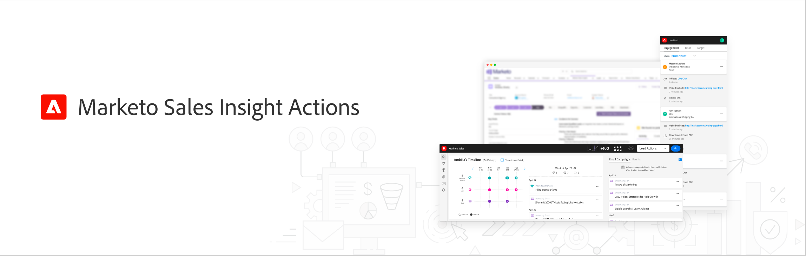
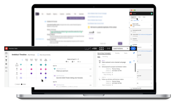
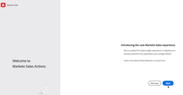
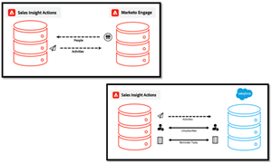

# 銷售分析動作Tutorials

使用 [!UICONTROL 銷售分析動作] 透過行銷支援的智慧和參與工具，在單一工作流程中加速開發潛在客戶。

>[!AVAILABILITY]
>
>此功能目前分階段推出。 請聯絡您的客戶成功案例經理或傳送電子郵件至 `sales-insights(at)adobe(dot)com` 以要求存取權。

## 精選Tutorials {#featured-tutorials}

<table style="table-layout:fixed">
<tr>
<td>

<a href="/help/sales-insight-actions/sales-insight-actions-overview.md"><strong>銷售分析動作概觀</strong></a>

</td>
<td>

<a href="/help/sales-insight-actions/accessing-your-sales-insight-actions-instance.md"><strong>存取您的Sales Insight Actions例項</strong></a>

</td>
<td>

<a href="/help/sales-insight-actions/configure-sales-activity-logging-to-salesforce.md"><strong>將銷售活動記錄設定為 [!DNL Salesforce]</strong></a>

</td>
</tr>
</table>

## 精選文章 {#featured-articles}

<table style="table-layout:fixed">
<tr>
<td>

<a href="https://experienceleague.adobe.com/docs/marketo/using/product-docs/marketo-sales-insight/actions/sales-insight-actions-feature-overview.html"><strong>Sales Insight Actions功能概述</strong></a>

<em>運用行銷支援的智慧和參與工具，加速探索潛在客戶的能力。</em>

</td>
<td>

<a href="https://experienceleague.adobe.com/docs/marketo/using/product-docs/marketo-sales-insight/actions/getting-started/sales-insight-actions-user-onboarding-checklist.html"><strong>[!DNL Sales Insight Actions] 使用者入門指南</strong></a>

<em>新使用者開始使用時需要遵循的步驟。</em>

</td>
<td>

<a href="https://experienceleague.adobe.com/docs/marketo/using/product-docs/marketo-sales-insight/actions/admin/actions-data-sync-faq.html"><strong>動作資料同步常見問題集</strong></a>

<em>與Data Unification Sync如何運作相關的常見問題。</em>

</td>
</tr>
</table>

## 個人化支援 {#personalized-support}

若要獲得此功能的個人化支援，請 [排程通話](https://outlook.office365.com/owa/calendar/AdobeInc1@adobe.onmicrosoft.com/bookings/) 與產品團隊合作。

## 回報錯誤/回饋 {#report-a-bug-feedback}

如果您遇到錯誤，或有關於此功能的一般意見，請寄電子郵件給我們 `sales-insights(at)adobe(dot)com`.
