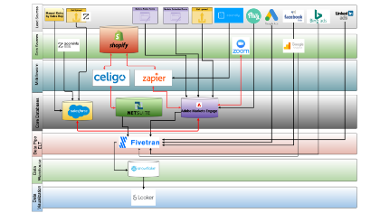

# 建立視覺化資料流程圖以瞭解您的行銷技術棧疊

作為管理已經存在多年的[!DNL Marketo Engage]執行個體的管理員，這就像是一項無法稽核並有效清理執行個體的任務。 當Adobe [!DNL Marketo Champion] (2019)，Kelly Jo Horton進入長期建立的執行個體時，她解決這個挑戰的方法是[建立「潛在客戶與資料來源」的圖表](https://nation.marketo.com/t5/employee-blogs/understand-your-marketing-technology-and-data-create-this/ba-p/296774){target="_blank"}，以熟悉資料世界。 在本教學課程中，您將瞭解如何透過建立Kelly Jo Horton分享的範例來建立自己的資料流程圖。 讓我們瞭解一下您的MarTech生態系統！

## 為什麼要為您繼承的執行個體建立架構圖？

1. **熟悉您從即時執行個體繼承的行銷技術棧疊。** 建議所有行銷作業管理員/平台作業管理員從新公司起步時都進行這項作業。 此建立程式可讓管理員使用者檢視從外部整合傳送到[!DNL Marketo Engage]的資料和活動的完整圖片，並輕鬆疑難排解API錯誤。
2. **熟悉管理外部整合的關鍵利害關係人。** Kelly Jo Horton用來快速識別利害關係人的一個技巧是參考API使用者清單。
   1. **導覽至「管理員」區段中的「整合>LaunchPoint」索引標籤。** 深入瞭解如何導覽至「LaunchPoint」標籤： [建立自訂服務以搭配REST API使用](https://experienceleague.adobe.com/docs/marketo/using/product-docs/administration/additional-integrations/create-a-custom-service-for-use-with-rest-api.html?lang=zh-Hant){target="_blank"}。
   2. 在API呼叫資訊區段的「整合>網站服務」標籤中，尋找API使用者的API使用統計資料。 按一下API呼叫號碼，即可檢視每個使用者發出的個別特定呼叫。

## 如何進行此視覺資料流程圖練習

### 步驟1：目前狀態圖

建立「目前狀態」圖表。 其範例如下：

{align="center"}

### 步驟2：未來狀態圖

建立「未來狀態」圖表，當向非技術性利害關係人展示技術和系統藍圖時可使用此圖表。 其範例如下：

{align="center"}

### 步驟3：技術版本

建立技術版本，顯示各項整合的API使用者名稱等詳細資訊、推送至[!DNL Marketo Engage]或從[!DNL Marketo Engage]提取之資料型別的簡短說明，以及任何中介軟體流程和觸發器的詳細圖表。範例如下：

{align="center"}

## 接下來呢？

**開始使用範例：**
下載其中一個範例資料流程圖表，以對應行銷技術棧疊的目前狀態、人員和資料流程，或在稽核執行個體時從頭開始建立資料全域的圖表：

<table style="table-layout:fixed">
   <tr>  
      <td style="border: 0;">
      

          <a href="./_assets/downloads/Current_Future_State_Lead_Data_Sources.zip">
            <strong>目前狀態和未來狀態</strong>
         </a>
      

      </td>
      <td style="border: 0;">
      

         <a href="./_assets/downloads/Detailed_Layers_by_Functional_Category_Stacked_Technologies.zip">
         <strong>依功能類別區分的詳細圖層</strong>   
         </a>
      

      </td>
      <td style="border: 0;">
         

         <a href="./_assets/downloads/Lead_Data_Source.zip">
           <strong>銷售機會與資料Source流程</strong>  
         </a>
         

       </td> 
       <td style="border: 0;">
         

         <a href="./_assets/downloads/Simple_World_Class_Stage_Stack.zip">
          <strong>簡圖</strong>  
         </a>
         

        </td>  
   </tr>
   <tr>
    <td style="border: 0;">
         

          
         </a>
      

      </td>
      <td style="border: 0;">
         

         
         

      </td>
       <td style="border: 0;">
         

            
         

      </td>
     <td style="border: 0;">
         

            
         

      </td>
</table>

以下是一些您可以使用的工具： draw.io (Google Docs)、Adobe XD、Figma、Gliffy (in Confluence)

**如果已經有架構圖表怎麼辦？** 新的團隊成員可能有不同的觀點。 讓新的[!DNL Marketo Engage]管理員在他們的上線流程中執行此練習並與其他人共用很有價值。

## 作者

**Kelly Jo Horton**\
Marketo王(2019)
Etumos的*資深使用者端合作夥伴*

{width="30%"}

**趙子楣**
*Adobe採用與保留行銷經理*

{width=30%}
